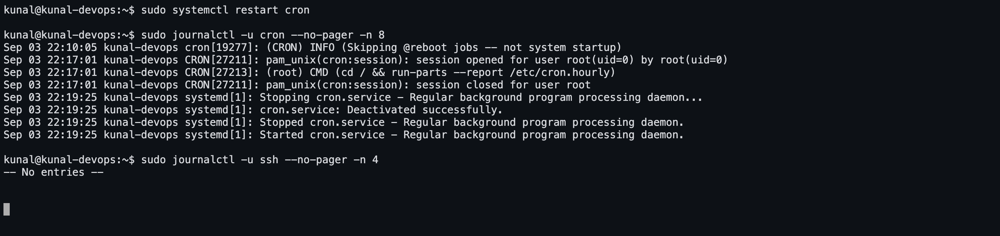

# Task 3 — `journalctl`

Run on **Ubuntu 26.04 LTS**, **systemd 259**, as `kunal@kunal-devops`.

---

## 1. What is `journalctl` used for?

`journalctl` is the tool for reading the **systemd journal** — the single structured,
indexed log that `systemd-journald` collects on every modern Linux system.

Everything lands in one place:

* kernel messages (what `dmesg` shows)
* early boot and initrd messages
* stdout/stderr of every service systemd starts
* anything written to syslog
* audit records and login / `sudo` events

Why it replaced tailing `/var/log/*`:

| Old way | journald |
|---|---|
| plain text files, one per program | one binary, **indexed** store |
| filtering with `grep` | native filters: unit, boot, priority, time, PID, user |
| no structure | key/value **structured fields** (`-o json`) |
| easy to lose ordering | append-only, sequence-numbered, can be sealed |
| rotation via `logrotate` | built-in size/time limits and `--vacuum-*` |

Storage lives in `/var/log/journal/<machine-id>/` when persistent, or `/run/log/journal/`
when volatile (wiped on reboot).

---

## 2. Screenshot — checking the logs of a specific service



`systemctl restart cron` followed by `journalctl -u cron` shows systemd logging
*Stopping → Deactivated → Stopped → Started* around the service's own messages, with
the restart appearing in the journal instantly.

---

## 3. The commands worth knowing

```bash
# --- basics ---
journalctl                     # everything, oldest first, in a pager
journalctl -n 50               # last 50 lines
journalctl -f                  # live follow, like tail -f
journalctl -r                  # newest first
journalctl --no-pager          # print straight to stdout (scripts)

# --- per service (the one used daily) ---
journalctl -u ssh              # all logs for the ssh unit
journalctl -u docker -n 100    # last 100 lines for docker
journalctl -u nginx -f         # follow one service live
journalctl -u nginx --since today
systemctl status nginx         # shows the last ~10 journal lines inline

# --- per boot ---
journalctl -b                  # current boot only
journalctl -b -1               # the PREVIOUS boot (why did it crash?)
journalctl --list-boots        # every boot still stored

# --- priority (syslog levels 0..7) ---
journalctl -p err              # err and worse
journalctl -p warning -b
journalctl -xb                 # current boot with explanations
journalctl -xe                 # the end of the log, with explanations

# --- time windows ---
journalctl --since "2026-09-03 10:00:00" --until "2026-09-03 11:00:00"
journalctl --since "1 hour ago"
journalctl --since yesterday

# --- other filters ---
journalctl -k                          # kernel messages only (= dmesg)
journalctl _PID=1234                   # by process id
journalctl /usr/sbin/sshd              # by executable
journalctl _UID=1000                   # by user
journalctl --user -u myapp.service     # a user unit
journalctl -u ssh -g "Failed password" # grep inside the journal

# --- output formats ---
journalctl -u ssh -o json-pretty       # the full structured record
journalctl -o short-precise            # microsecond timestamps
journalctl -o cat                      # message text only

# --- housekeeping ---
journalctl --disk-usage
sudo journalctl --vacuum-time=30d      # drop entries older than 30 days
sudo journalctl --vacuum-size=200M     # cap the journal at 200 MB
journalctl --verify                    # integrity check
```

The routine for a failing service:

```bash
sudo systemctl status myapp                  # running? what exit code?
sudo journalctl -u myapp -n 100 --no-pager   # what did it print before dying?
sudo journalctl -u myapp -f                  # watch while restarting it
```

---

## 4. Full session output

```console

############################################################
#  0. The machine
############################################################

kunal@kunal-devops:~$ hostnamectl | head -n 6
 Static hostname: kunal-devops
       Icon name: computer-vm
         Chassis: vm 🖴
      Machine ID: df1003417c89478b8407647c4b045f66
         Boot ID: 0556b71c1fd64acf9c195431391ebfa9
    AF_VSOCK CID: 3

kunal@kunal-devops:~$ systemctl --version | head -n 1
systemd 259 (259.5-0ubuntu3)

kunal@kunal-devops:~$ cat /etc/os-release | head -n 3
PRETTY_NAME="Ubuntu 26.04 LTS"
NAME="Ubuntu"
VERSION_ID="26.04"


############################################################
#  1. Where the journal lives
############################################################

kunal@kunal-devops:~$ sudo journalctl --disk-usage
Archived and active journals take up 8M in the file system.

kunal@kunal-devops:~$ ls -la /var/log/journal
total 12
drwxr-sr-x+ 3 root systemd-journal 4096 Sep  3 22:06 .
drwxrwxr-x 10 root syslog          4096 Sep  3 22:07 ..
drwxr-sr-x+ 2 root systemd-journal 4096 Sep  3 22:09 df1003417c89478b8407647c4b045f66


############################################################
#  2. The most recent log lines
############################################################

kunal@kunal-devops:~$ sudo journalctl -n 12 --no-pager
Sep 03 22:10:05 kunal-devops sshd-session[19173]: pam_unix(sshd:session): session opened for user kunal(uid=501) by kunal(uid=0)
Sep 03 22:10:05 kunal-devops systemd-logind[1510]: New session '17' of user 'kunal' with class 'user' and type 'tty'.
Sep 03 22:10:05 kunal-devops systemd[1]: Started session-17.scope - Session 17 of User kunal.
Sep 03 22:10:05 kunal-devops dbus-daemon[1491]: [system] Activating via systemd: service name='org.freedesktop.hostname1' unit='dbus-org.freedesktop.hostname1.service' requested by ':1.38' (uid=501 pid=19225 comm="hostnamectl" label="unconfined")
Sep 03 22:10:05 kunal-devops systemd[1]: Starting systemd-hostnamed.service - Hostname Service...
Sep 03 22:10:05 kunal-devops systemd[1]: Started systemd-hostnamed.service - Hostname Service.
Sep 03 22:10:05 kunal-devops dbus-daemon[1491]: [system] Successfully activated service 'org.freedesktop.hostname1'
Sep 03 22:10:05 kunal-devops sudo[19240]: pam_unix(sudo:session): session opened for user root(uid=0) by kunal(uid=501)
Sep 03 22:10:05 kunal-devops sudo[19240]: kunal :  PWD=/home/kunal ; USER=root ; COMMAND=/usr/bin/journalctl --disk-usage
Sep 03 22:10:05 kunal-devops sudo[19240]: pam_unix(sudo:session): session closed for user root
Sep 03 22:10:05 kunal-devops sudo[19248]: pam_unix(sudo:session): session opened for user root(uid=0) by kunal(uid=501)
Sep 03 22:10:05 kunal-devops sudo[19248]: kunal :  PWD=/home/kunal ; USER=root ; COMMAND=/usr/bin/journalctl -n 12 --no-pager


############################################################
#  3. Logs since this boot
############################################################

kunal@kunal-devops:~$ sudo journalctl -b --no-pager | head -n 12
Sep 03 22:09:56 kunal-devops systemd-journald[920]: System Journal (/var/log/journal/df1003417c89478b8407647c4b045f66) is 8M, max 240.8M, 232.8M free.
Sep 03 22:09:56 kunal-devops systemd-journald[920]: Received client request to rotate journal, rotating.
Sep 03 22:09:56 kunal-devops (cron)[18651]: cron.service: Referenced but unset environment variable evaluates to an empty string: EXTRA_OPTS
Sep 03 22:09:56 kunal-devops cron[18651]: (CRON) INFO (pidfile fd = 3)
Sep 03 22:09:56 kunal-devops systemd-journald[920]: Vacuuming done, freed 0B of archived journals from /var/log/journal/df1003417c89478b8407647c4b045f66.
Sep 03 22:09:56 kunal-devops cron[18651]: (CRON) INFO (Skipping @reboot jobs -- not system startup)
Sep 03 22:09:56 kunal-devops sudo[18652]: pam_unix(sudo:session): session closed for user root
Sep 03 22:09:56 kunal-devops sudo[18656]: pam_unix(sudo:session): session opened for user root(uid=0) by kunal(uid=501)
Sep 03 22:09:56 kunal-devops sudo[18656]: kunal :  PWD=/home/kunal ; USER=root ; COMMAND=/usr/bin/journalctl --vacuum-time=1s
Sep 03 22:09:56 kunal-devops sudo[18656]: pam_unix(sudo:session): session closed for user root
Sep 03 22:09:56 kunal-devops sshd-session[18623]: Received disconnect from UNKNOWN port 65535:11: disconnected by user
Sep 03 22:09:56 kunal-devops sshd-session[18623]: Disconnected from user kunal UNKNOWN port 65535

kunal@kunal-devops:~$ sudo journalctl --list-boots --no-pager
IDX BOOT ID                          FIRST ENTRY                 LAST ENTRY
  0 0556b71c1fd64acf9c195431391ebfa9 Thu 2026-09-03 22:09:56 IST Thu 2026-09-03 22:10:05 IST


############################################################
#  4. Logs for ONE service - ssh
############################################################

kunal@kunal-devops:~$ systemctl status ssh --no-pager | head -n 12
● ssh.service - OpenBSD Secure Shell server
     Loaded: loaded (/usr/lib/systemd/system/ssh.service; disabled; preset: enabled)
     Active: active (running) since Thu 2026-09-03 22:07:01 IST; 3min 4s ago
 Invocation: 395d410f927745b7b0ecf066a8fdd4c9
TriggeredBy: ● ssh.socket
       Docs: man:sshd(8)
             man:sshd_config(5)
   Main PID: 1771 (sshd)
      Tasks: 1 (limit: 8568)
     Memory: 1.2M (peak: 3.6M)
        CPU: 28ms
     CGroup: /system.slice/ssh.service

kunal@kunal-devops:~$ sudo journalctl -u ssh --no-pager -n 12
-- No entries --


############################################################
#  5. Restart a service and watch its new entries appear
############################################################

kunal@kunal-devops:~$ sudo systemctl restart cron

kunal@kunal-devops:~$ sudo journalctl -u cron --no-pager -n 10
Sep 03 22:09:56 kunal-devops (cron)[18651]: cron.service: Referenced but unset environment variable evaluates to an empty string: EXTRA_OPTS
Sep 03 22:09:56 kunal-devops cron[18651]: (CRON) INFO (pidfile fd = 3)
Sep 03 22:09:56 kunal-devops cron[18651]: (CRON) INFO (Skipping @reboot jobs -- not system startup)
Sep 03 22:10:05 kunal-devops systemd[1]: Stopping cron.service - Regular background program processing daemon...
Sep 03 22:10:05 kunal-devops systemd[1]: cron.service: Deactivated successfully.
Sep 03 22:10:05 kunal-devops systemd[1]: Stopped cron.service - Regular background program processing daemon.
Sep 03 22:10:05 kunal-devops systemd[1]: Started cron.service - Regular background program processing daemon.
Sep 03 22:10:05 kunal-devops (cron)[19277]: cron.service: Referenced but unset environment variable evaluates to an empty string: EXTRA_OPTS
Sep 03 22:10:05 kunal-devops cron[19277]: (CRON) INFO (pidfile fd = 3)
Sep 03 22:10:05 kunal-devops cron[19277]: (CRON) INFO (Skipping @reboot jobs -- not system startup)


############################################################
#  6. Restart Docker and read its log too
############################################################

kunal@kunal-devops:~$ sudo systemctl restart docker

kunal@kunal-devops:~$ sudo journalctl -u docker --no-pager -n 8
Sep 03 22:10:05 kunal-devops dockerd[19289]: time="2026-09-03T22:10:05.839562279+05:30" level=info msg="Deleting nftables IPv6 rules" error="exit status 1"
Sep 03 22:10:06 kunal-devops dockerd[19289]: time="2026-09-03T22:10:06.021038082+05:30" level=info msg="Loading containers: done."
Sep 03 22:10:06 kunal-devops dockerd[19289]: time="2026-09-03T22:10:06.023744611+05:30" level=info msg="Docker daemon" commit=29.1.3-0ubuntu4.1 containerd-snapshotter=true storage-driver=overlayfs version=29.1.3
Sep 03 22:10:06 kunal-devops dockerd[19289]: time="2026-09-03T22:10:06.023787605+05:30" level=info msg="Initializing buildkit"
Sep 03 22:10:06 kunal-devops dockerd[19289]: time="2026-09-03T22:10:06.026295537+05:30" level=info msg="Completed buildkit initialization"
Sep 03 22:10:06 kunal-devops dockerd[19289]: time="2026-09-03T22:10:06.028764682+05:30" level=info msg="Daemon has completed initialization"
Sep 03 22:10:06 kunal-devops dockerd[19289]: time="2026-09-03T22:10:06.028794803+05:30" level=info msg="API listen on /run/docker.sock"
Sep 03 22:10:06 kunal-devops systemd[1]: Started docker.service - Docker Application Container Engine.


############################################################
#  7. Filter by priority - errors and worse
############################################################

kunal@kunal-devops:~$ sudo journalctl -p err -b --no-pager | tail -n 10
Sep 03 22:10:05 kunal-devops deluser[18927]: The user `testuser' does not exist.

kunal@kunal-devops:~$ sudo journalctl -xe --no-pager | tail -n 6
Sep 03 22:10:06 kunal-devops sudo[19486]: pam_unix(sudo:session): session closed for user root
Sep 03 22:10:06 kunal-devops sudo[19491]: pam_unix(sudo:session): session opened for user root(uid=0) by kunal(uid=501)
Sep 03 22:10:06 kunal-devops sudo[19491]: kunal :  PWD=/home/kunal ; USER=root ; COMMAND=/usr/bin/journalctl -p err -b --no-pager
Sep 03 22:10:06 kunal-devops sudo[19491]: pam_unix(sudo:session): session closed for user root
Sep 03 22:10:06 kunal-devops sudo[19497]: pam_unix(sudo:session): session opened for user root(uid=0) by kunal(uid=501)
Sep 03 22:10:06 kunal-devops sudo[19497]: kunal :  PWD=/home/kunal ; USER=root ; COMMAND=/usr/bin/journalctl -xe --no-pager


############################################################
#  8. Filter by time
############################################################

kunal@kunal-devops:~$ sudo journalctl --since '10 minutes ago' --no-pager | tail -n 8
Sep 03 22:10:06 kunal-devops sudo[19491]: pam_unix(sudo:session): session opened for user root(uid=0) by kunal(uid=501)
Sep 03 22:10:06 kunal-devops sudo[19491]: kunal :  PWD=/home/kunal ; USER=root ; COMMAND=/usr/bin/journalctl -p err -b --no-pager
Sep 03 22:10:06 kunal-devops sudo[19491]: pam_unix(sudo:session): session closed for user root
Sep 03 22:10:06 kunal-devops sudo[19497]: pam_unix(sudo:session): session opened for user root(uid=0) by kunal(uid=501)
Sep 03 22:10:06 kunal-devops sudo[19497]: kunal :  PWD=/home/kunal ; USER=root ; COMMAND=/usr/bin/journalctl -xe --no-pager
Sep 03 22:10:06 kunal-devops sudo[19497]: pam_unix(sudo:session): session closed for user root
Sep 03 22:10:06 kunal-devops sudo[19503]: pam_unix(sudo:session): session opened for user root(uid=0) by kunal(uid=501)
Sep 03 22:10:06 kunal-devops sudo[19503]: kunal :  PWD=/home/kunal ; USER=root ; COMMAND=/usr/bin/journalctl --since 10 minutes ago --no-pager

kunal@kunal-devops:~$ sudo journalctl -u ssh --since today --no-pager | wc -l
1


############################################################
#  9. Kernel messages only
############################################################

kunal@kunal-devops:~$ sudo journalctl -k --no-pager | head -n 8
Sep 03 22:09:56 kunal-devops systemd-journald[920]: Received client request to rotate journal, rotating.
Sep 03 22:09:56 kunal-devops systemd-journald[920]: Vacuuming done, freed 0B of archived journals from /var/log/journal/df1003417c89478b8407647c4b045f66.


############################################################
#  10. Structured output and housekeeping
############################################################

kunal@kunal-devops:~$ sudo journalctl -u ssh -o json-pretty --no-pager -n 1 | head -n 20

kunal@kunal-devops:~$ sudo journalctl -o short-precise -n 3 --no-pager
Sep 03 22:10:06.067053 kunal-devops sudo[19521]: pam_unix(sudo:session): session closed for user root
Sep 03 22:10:06.071963 kunal-devops sudo[19527]: pam_unix(sudo:session): session opened for user root(uid=0) by kunal(uid=501)
Sep 03 22:10:06.071993 kunal-devops sudo[19527]: kunal :  PWD=/home/kunal ; USER=root ; COMMAND=/usr/bin/journalctl -o short-precise -n 3 --no-pager

kunal@kunal-devops:~$ sudo journalctl --vacuum-time=30d 2>&1 | tail -n 3
Vacuuming done, freed 0B of archived journals from /run/log/journal.
Vacuuming done, freed 0B of archived journals from /var/log/journal.
Vacuuming done, freed 0B of archived journals from /var/log/journal/df1003417c89478b8407647c4b045f66.

Live follow (never exits, so not captured here):  sudo journalctl -f -u ssh
```

---

## 5. Interview answers

**Q. What is journalctl?**
The query tool for the systemd journal — a structured, indexed binary log collected by
`systemd-journald` covering the kernel, boot, every systemd unit and syslog.

**Q. How do you see the logs of one service?**
`journalctl -u <unit>`, with `-n 100` for the tail, `-f` to follow, or
`--since "1 hour ago"`.

**Q. A server rebooted unexpectedly — where do you look?**
`journalctl -b -1 -p err` — the previous boot, errors and worse.
`journalctl --list-boots` shows which boots are still stored.

**Q. Journal logs disappear after reboot. Why?**
`/var/log/journal` does not exist, so journald is in volatile mode under `/run`. Fix:
`sudo mkdir -p /var/log/journal && sudo systemctl restart systemd-journald`, or set
`Storage=persistent` in `/etc/systemd/journald.conf`.

**Q. The journal is filling the disk.**
`journalctl --disk-usage` to confirm, then `sudo journalctl --vacuum-size=200M` or
`--vacuum-time=7d`, and set `SystemMaxUse=` in `/etc/systemd/journald.conf` so it stays
capped.

**Q. journalctl vs `/var/log/syslog`?**
`syslog` is plain text written by rsyslog; the journal is binary, structured and
indexed, and captures service stdout/stderr and early boot messages that never reach
syslog. On Ubuntu both can coexist — rsyslog reads from the journal.
