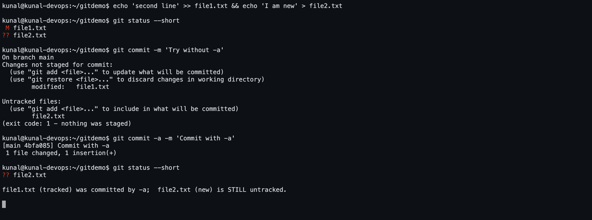

# Git Task 1 — `git commit -a -m` vs `git commit -m`

## The three places a change can live

```
  working directory  →  staging area (index)  →  repository (commits)
        (edit)               (git add)              (git commit)
```

`git commit` only ever commits what is in the **staging area**.

## The difference in one table

| | `git commit -m "msg"` | `git commit -a -m "msg"` |
|---|---|---|
| What it commits | **only what has already been `git add`-ed** | staged changes **plus** all modified *tracked* files |
| Modified tracked file, not added | ignored | **automatically staged and committed** |
| Deleted tracked file | ignored | **automatically staged and committed** |
| **New untracked file** | ignored | **still ignored** — `-a` never adds new files |
| Effectively | `commit` | `git add -u` + `commit` |
| Control over what goes in | full — you choose file by file | none — everything tracked and modified goes in |

**The one sentence to remember:** `-a` stands for *all tracked files*, not *all files*.
A brand-new file always needs an explicit `git add`.

## Commands

```bash
git add file.txt              # stage one file
git add .                     # stage everything in this directory, new files included
git add -u                    # stage modifications and deletions of TRACKED files only
git commit -m "message"       # commit whatever is staged
git commit -a -m "message"    # stage tracked modifications, then commit
git commit -am "message"      # same thing, flags combined
git status                    # what is staged, modified, untracked
git status --short            # compact:  M = modified   A = added   ?? = untracked
git diff                      # working directory vs staging area
git diff --staged             # staging area vs last commit
```

Reading `git status --short`: the **first column** is the staging area, the **second**
is the working directory. So ` M` = modified but not staged, `M ` = staged, `MM` = both,
`??` = untracked.

## Screenshot



## Practical session — testing both commands (real output)

```console

############################################################
#  Setup
############################################################

kunal@kunal-devops:~/gitlab1$ git init -b main
Initialized empty Git repository in /home/kunal/gitlab1/.git/

kunal@kunal-devops:~/gitlab1$ git config user.name 'Kunal Kumar'

kunal@kunal-devops:~/gitlab1$ git config user.email 'kunalsain0324@gmail.com'

kunal@kunal-devops:~/gitlab1$ echo 'first line' > file1.txt

kunal@kunal-devops:~/gitlab1$ git add file1.txt

kunal@kunal-devops:~/gitlab1$ git commit -m 'Initial commit: add file1.txt'
[main (root-commit) d205c5f] Initial commit: add file1.txt
 1 file changed, 1 insertion(+)
 create mode 100644 file1.txt

kunal@kunal-devops:~/gitlab1$ git log --oneline
d205c5f Initial commit: add file1.txt


############################################################
#  A. git commit -m   (WITHOUT -a)
############################################################

Modify a TRACKED file and create a NEW untracked file, then try to commit.
kunal@kunal-devops:~/gitlab1$ echo 'second line' >> file1.txt

kunal@kunal-devops:~/gitlab1$ echo 'I am new' > file2.txt

kunal@kunal-devops:~/gitlab1$ git status --short
 M file1.txt
?? file2.txt

Legend:  ' M' = tracked file modified but NOT staged      '??' = untracked

kunal@kunal-devops:~/gitlab1$ git commit -m 'Try to commit without -a'
On branch main
Changes not staged for commit:
  (use "git add <file>..." to update what will be committed)
  (use "git restore <file>..." to discard changes in working directory)
	modified:   file1.txt

Untracked files:
  (use "git add <file>..." to include in what will be committed)
	file2.txt

no changes added to commit (use "git add" and/or "git commit -a")
(exit code: 1)

>>> Nothing was committed. 'git commit -m' only commits what is already STAGED,
>>> and we never ran 'git add'.

kunal@kunal-devops:~/gitlab1$ git log --oneline
d205c5f Initial commit: add file1.txt


############################################################
#  B. git commit -a -m
############################################################

kunal@kunal-devops:~/gitlab1$ git commit -a -m 'Commit with -a: picks up the modified tracked file'
[main 67c6487] Commit with -a: picks up the modified tracked file
 1 file changed, 1 insertion(+)

kunal@kunal-devops:~/gitlab1$ git log --oneline
67c6487 Commit with -a: picks up the modified tracked file
d205c5f Initial commit: add file1.txt

kunal@kunal-devops:~/gitlab1$ git status --short
?? file2.txt

>>> file1.txt (TRACKED + modified) was staged automatically and committed.
>>> file2.txt is STILL untracked - '-a' does NOT add new files.

############################################################
#  C. A new file still needs git add
############################################################

kunal@kunal-devops:~/gitlab1$ git add file2.txt

kunal@kunal-devops:~/gitlab1$ git commit -m 'Add file2.txt with git add + git commit -m'
[main 7c676e8] Add file2.txt with git add + git commit -m
 1 file changed, 1 insertion(+)
 create mode 100644 file2.txt

kunal@kunal-devops:~/gitlab1$ git log --oneline
7c676e8 Add file2.txt with git add + git commit -m
67c6487 Commit with -a: picks up the modified tracked file
d205c5f Initial commit: add file1.txt

kunal@kunal-devops:~/gitlab1$ git status
On branch main
nothing to commit, working tree clean


############################################################
#  D. What -a is really equivalent to
############################################################

kunal@kunal-devops:~/gitlab1$ echo 'third line' >> file1.txt

kunal@kunal-devops:~/gitlab1$ rm file2.txt

kunal@kunal-devops:~/gitlab1$ git status --short
 M file1.txt
 D file2.txt

'-a' stages modifications AND deletions of tracked files - watch file2.txt get deleted too:
kunal@kunal-devops:~/gitlab1$ git commit -a -m 'Third line added and file2.txt deleted, both picked up by -a'
[main 27d8672] Third line added and file2.txt deleted, both picked up by -a
 2 files changed, 1 insertion(+), 1 deletion(-)
 delete mode 100644 file2.txt

kunal@kunal-devops:~/gitlab1$ git show --stat HEAD
commit 27d86725b4270a8da04afd60959a258a966c764f
Author: Kunal Kumar <kunalsain0324@gmail.com>
Date:   Thu Sep 3 22:10:20 2026 +0530

    Third line added and file2.txt deleted, both picked up by -a

 file1.txt | 1 +
 file2.txt | 1 -
 2 files changed, 1 insertion(+), 1 deletion(-)

kunal@kunal-devops:~/gitlab1$ git log --oneline
27d8672 Third line added and file2.txt deleted, both picked up by -a
7c676e8 Add file2.txt with git add + git commit -m
67c6487 Commit with -a: picks up the modified tracked file
d205c5f Initial commit: add file1.txt
```

## What the run proves

1. **`git commit -m` with nothing staged committed nothing.** Git replied
   *"no changes added to commit (use "git add" and/or "git commit -a")"* and exited
   non-zero. `git log` was unchanged.
2. **`git commit -a -m` worked without any `git add`.** It picked up the modification to
   `file1.txt` — a **tracked** file — and committed it.
3. **`file2.txt` was still untracked afterwards.** `-a` did not add it. It only got into
   the repository after an explicit `git add file2.txt`.
4. The last step showed what `-a` really covers: `file1.txt` was **modified** and
   `file2.txt` was **deleted**, and a single `git commit -a -m` picked up **both** —
   `git show --stat` lists one insertion and one deleted file. That is the precise
   definition: `-a` stages modifications *and* deletions of already-tracked files.

## When to use which

* **`git commit -m`** when the change should be reviewed and split — stage precisely
  what belongs in this commit (`git add -p` is even better) and leave the rest for the
  next one. This is the habit that produces a clean, reviewable history.
* **`git commit -a -m`** for quick work where everything modified belongs together — a
  typo fix, a small refactor, a WIP commit on your own branch.

**The trap:** `-a` quietly sweeps in every modified tracked file, including a debug
`print()` left in another file. Running `git status` before committing costs one second
and avoids it.

## Interview answers

**Q. What does `-a` do in `git commit -a -m`?**
It automatically stages all **modified and deleted tracked** files before committing, so
you skip `git add`. It does **not** stage new untracked files.

**Q. So `git commit -am` is the same as `git add . && git commit -m`?**
No — and that is the classic trap. `git add .` stages new files too. `-a` is equivalent
to `git add -u`.

**Q. You ran `git commit -m` and got "no changes added to commit". Why?**
The files were modified but never staged. Either `git add <file>` first, or use
`git commit -a -m`.
