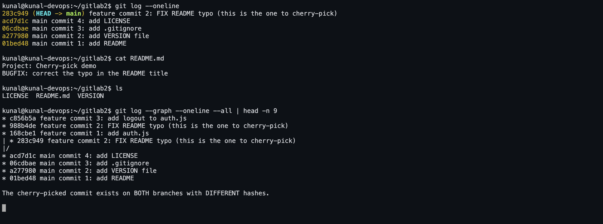

# Git Task 2 — `git cherry-pick`

## What cherry-pick is

`git cherry-pick <commit>` takes **one specific commit** from anywhere in the repository
and replays its changes on top of the branch you are currently on. It creates a **new
commit with a new hash** — the same content and message, a different parent.

```
main      A───B───C───D─────────────► D───F'      (F' = cherry-picked copy of F)
                   \
feature             E───F───G                     (F stays where it is too)
```

Compare it with the alternatives:

| Command | Brings over |
|---|---|
| `git merge feature` | **all** commits on the branch, plus a merge commit |
| `git rebase main` | **all** commits, replayed on a new base |
| `git cherry-pick <hash>` | **exactly the one commit** you name |

Typical real use: a bug fix that landed on a long-running feature branch is needed on
`main` (or on a release branch) *now*, without shipping the half-finished feature around
it.

## Commands

```bash
git log --oneline                  # find the commit hash
git log --oneline main..feature    # commits on feature that main does not have
git show <hash>                    # inspect exactly what that commit changes

git checkout main
git cherry-pick <hash>             # apply that one commit here
git cherry-pick <h1> <h2>          # several commits
git cherry-pick <h1>^..<h2>        # an inclusive range
git cherry-pick -n <hash>          # apply the change but do NOT commit yet
git cherry-pick -x <hash>          # add a "(cherry picked from ...)" line to the message

# if it conflicts
git status                         # see the conflicting files
# ...fix the files...
git add <fixed files>
git cherry-pick --continue
git cherry-pick --abort            # give up and return to the previous state
```

## Screenshot



## Practical session — real output

Four commits on `main`, three on a `feature` branch, then one specific commit from
`feature` cherry-picked into `main`.

```console

############################################################
#  Step 0. Create the repository
############################################################

kunal@kunal-devops:~/gitlab2$ git init -b main
Initialized empty Git repository in /home/kunal/gitlab2/.git/

kunal@kunal-devops:~/gitlab2$ git config user.name 'Kunal Kumar'

kunal@kunal-devops:~/gitlab2$ git config user.email 'kunalsain0324@gmail.com'


############################################################
#  Step 1. Make 4 commits on main
############################################################

kunal@kunal-devops:~/gitlab2$ echo 'Project: Cherry-pick demo' > README.md && git add README.md && git commit -m 'main commit 1: add README'
[main (root-commit) 01bed48] main commit 1: add README
 1 file changed, 1 insertion(+)
 create mode 100644 README.md

kunal@kunal-devops:~/gitlab2$ echo 'v1.0' > VERSION && git add VERSION && git commit -m 'main commit 2: add VERSION file'
[main a277980] main commit 2: add VERSION file
 1 file changed, 1 insertion(+)
 create mode 100644 VERSION

kunal@kunal-devops:~/gitlab2$ echo 'node_modules/' > .gitignore && git add .gitignore && git commit -m 'main commit 3: add .gitignore'
[main 06cdbae] main commit 3: add .gitignore
 1 file changed, 1 insertion(+)
 create mode 100644 .gitignore

kunal@kunal-devops:~/gitlab2$ echo 'MIT License' > LICENSE && git add LICENSE && git commit -m 'main commit 4: add LICENSE'
[main acd7d1c] main commit 4: add LICENSE
 1 file changed, 1 insertion(+)
 create mode 100644 LICENSE


############################################################
#  Step 2. View the commits with git log
############################################################

kunal@kunal-devops:~/gitlab2$ git log --oneline
acd7d1c main commit 4: add LICENSE
06cdbae main commit 3: add .gitignore
a277980 main commit 2: add VERSION file
01bed48 main commit 1: add README

kunal@kunal-devops:~/gitlab2$ git log --graph --oneline --all
* acd7d1c main commit 4: add LICENSE
* 06cdbae main commit 3: add .gitignore
* a277980 main commit 2: add VERSION file
* 01bed48 main commit 1: add README


############################################################
#  Step 3. Create a new branch
############################################################

kunal@kunal-devops:~/gitlab2$ git branch feature

kunal@kunal-devops:~/gitlab2$ git checkout feature
Switched to branch 'feature'

kunal@kunal-devops:~/gitlab2$ git branch -v
* feature acd7d1c main commit 4: add LICENSE
  main    acd7d1c main commit 4: add LICENSE


############################################################
#  Step 4. Make 3 commits on the new branch
############################################################

kunal@kunal-devops:~/gitlab2$ echo 'function login() {}' > auth.js && git add auth.js && git commit -m 'feature commit 1: add auth.js'
[feature 168cbe1] feature commit 1: add auth.js
 1 file changed, 1 insertion(+)
 create mode 100644 auth.js

kunal@kunal-devops:~/gitlab2$ printf 'BUGFIX: correct the typo in the README title\n' >> README.md && git add README.md && git commit -m 'feature commit 2: FIX README typo (this is the one to cherry-pick)'
[feature 988b4de] feature commit 2: FIX README typo (this is the one to cherry-pick)
 1 file changed, 1 insertion(+)

kunal@kunal-devops:~/gitlab2$ echo 'function logout() {}' >> auth.js && git add auth.js && git commit -m 'feature commit 3: add logout to auth.js'
[feature c856b5a] feature commit 3: add logout to auth.js
 1 file changed, 1 insertion(+)


############################################################
#  Step 5. git log - identify the specific commit
############################################################

kunal@kunal-devops:~/gitlab2$ git log --oneline
c856b5a feature commit 3: add logout to auth.js
988b4de feature commit 2: FIX README typo (this is the one to cherry-pick)
168cbe1 feature commit 1: add auth.js
acd7d1c main commit 4: add LICENSE
06cdbae main commit 3: add .gitignore
a277980 main commit 2: add VERSION file
01bed48 main commit 1: add README

kunal@kunal-devops:~/gitlab2$ git log --oneline main..feature
c856b5a feature commit 3: add logout to auth.js
988b4de feature commit 2: FIX README typo (this is the one to cherry-pick)
168cbe1 feature commit 1: add auth.js

The commit wanted on main is 'feature commit 2: FIX README typo'.
kunal@kunal-devops:~/gitlab2$ PICK=$(git log --format='%h %s' | grep 'FIX README typo' | cut -d' ' -f1); echo "Chosen commit hash: $PICK"; echo $PICK > /tmp/pick_hash
Chosen commit hash: 988b4de

kunal@kunal-devops:~/gitlab2$ git show $(cat /tmp/pick_hash) --stat
commit 988b4de23aca8ae598833fd9ef8d278231d987e3
Author: Kunal Kumar <kunalsain0324@gmail.com>
Date:   Thu Sep 3 22:10:20 2026 +0530

    feature commit 2: FIX README typo (this is the one to cherry-pick)

 README.md | 1 +
 1 file changed, 1 insertion(+)


############################################################
#  Step 6. Back to main, then cherry-pick that ONE commit
############################################################

kunal@kunal-devops:~/gitlab2$ git checkout main
Switched to branch 'main'

kunal@kunal-devops:~/gitlab2$ git log --oneline
acd7d1c main commit 4: add LICENSE
06cdbae main commit 3: add .gitignore
a277980 main commit 2: add VERSION file
01bed48 main commit 1: add README

kunal@kunal-devops:~/gitlab2$ cat README.md
Project: Cherry-pick demo

main does NOT contain the fix yet.

kunal@kunal-devops:~/gitlab2$ git cherry-pick $(cat /tmp/pick_hash)
[main 283c949] feature commit 2: FIX README typo (this is the one to cherry-pick)
 Date: Thu Sep 3 22:10:20 2026 +0530
 1 file changed, 1 insertion(+)


############################################################
#  Step 7. Verify the change is now on main
############################################################

kunal@kunal-devops:~/gitlab2$ git log --oneline
283c949 feature commit 2: FIX README typo (this is the one to cherry-pick)
acd7d1c main commit 4: add LICENSE
06cdbae main commit 3: add .gitignore
a277980 main commit 2: add VERSION file
01bed48 main commit 1: add README

kunal@kunal-devops:~/gitlab2$ cat README.md
Project: Cherry-pick demo
BUGFIX: correct the typo in the README title

>>> The BUGFIX line is now in README.md on main.
>>> auth.js from feature commits 1 and 3 was NOT brought across:
kunal@kunal-devops:~/gitlab2$ ls
LICENSE
README.md
VERSION

kunal@kunal-devops:~/gitlab2$ git log --graph --oneline --all
* c856b5a feature commit 3: add logout to auth.js
* 988b4de feature commit 2: FIX README typo (this is the one to cherry-pick)
* 168cbe1 feature commit 1: add auth.js
| * 283c949 feature commit 2: FIX README typo (this is the one to cherry-pick)
|/  
* acd7d1c main commit 4: add LICENSE
* 06cdbae main commit 3: add .gitignore
* a277980 main commit 2: add VERSION file
* 01bed48 main commit 1: add README

kunal@kunal-devops:~/gitlab2$ git show HEAD --stat
commit 283c949be2d1c93a210db1211a6257527eaf97db
Author: Kunal Kumar <kunalsain0324@gmail.com>
Date:   Thu Sep 3 22:10:20 2026 +0530

    feature commit 2: FIX README typo (this is the one to cherry-pick)

 README.md | 1 +
 1 file changed, 1 insertion(+)


############################################################
#  Step 8. Same change, two different hashes
############################################################

kunal@kunal-devops:~/gitlab2$ git log --format='%h %s' -n 1 main
283c949 feature commit 2: FIX README typo (this is the one to cherry-pick)

kunal@kunal-devops:~/gitlab2$ git log --format='%h %s' feature | grep 'FIX README typo'
988b4de feature commit 2: FIX README typo (this is the one to cherry-pick)

Same content and message, different parent -> different SHA. cherry-pick COPIES a commit.
```

## Verification — the change is on `main`

* Before the cherry-pick, `cat README.md` on `main` showed only
  `Project: Cherry-pick demo`.
* After `git cherry-pick 988b4de`, `cat README.md` on `main` shows the added
  `BUGFIX: correct the typo in the README title` line.
* `git log --oneline` on `main` now lists
  `feature commit 2: FIX README typo` sitting directly on top of
  `main commit 4: add LICENSE`.
* `ls` on `main` shows `LICENSE`, `README.md`, `VERSION` — **`auth.js` was not brought
  over**, which is the whole point: feature commits 1 and 3 stayed on `feature`.
* `git log --graph --oneline --all` shows the commit existing in **two places** with
  **two different hashes**: `988b4de` on `feature` and `283c949` on `main`. Same change,
  same message, different parent — so a different SHA.

## Things worth knowing

* **The hash always changes.** A commit's SHA is computed from its content *and* its
  parent, so a cherry-picked commit is a copy, not a move. The original stays put.
* **Use `-x`** when cherry-picking into a release branch: it appends
  `(cherry picked from commit <hash>)` to the message, so months later you can tell
  where the change came from.
* **Merging later can conflict.** If `feature` is eventually merged into `main`, git
  usually works out that the change is already there, but a modified cherry-pick can
  produce a conflict. Cherry-pick is for one-off transplants, not as a substitute for
  merging.
* **Conflicts are normal** when the target branch has moved on. Resolve the files,
  `git add` them, then `git cherry-pick --continue`.

## Interview answers

**Q. What does cherry-pick do?**
Applies the changes introduced by one specific commit onto the current branch as a new
commit.

**Q. When would you use it instead of merge?**
When only one commit is wanted — a hotfix on a feature branch that must ship on `main`
or a release branch immediately, without dragging along the rest of the branch.

**Q. Does it move the commit?**
No, it copies it. The original commit stays on its branch and the copy gets a new hash.

**Q. What if it conflicts?**
`git status` to see the conflicted files, resolve them, `git add`, then
`git cherry-pick --continue` — or `git cherry-pick --abort` to back out entirely.
