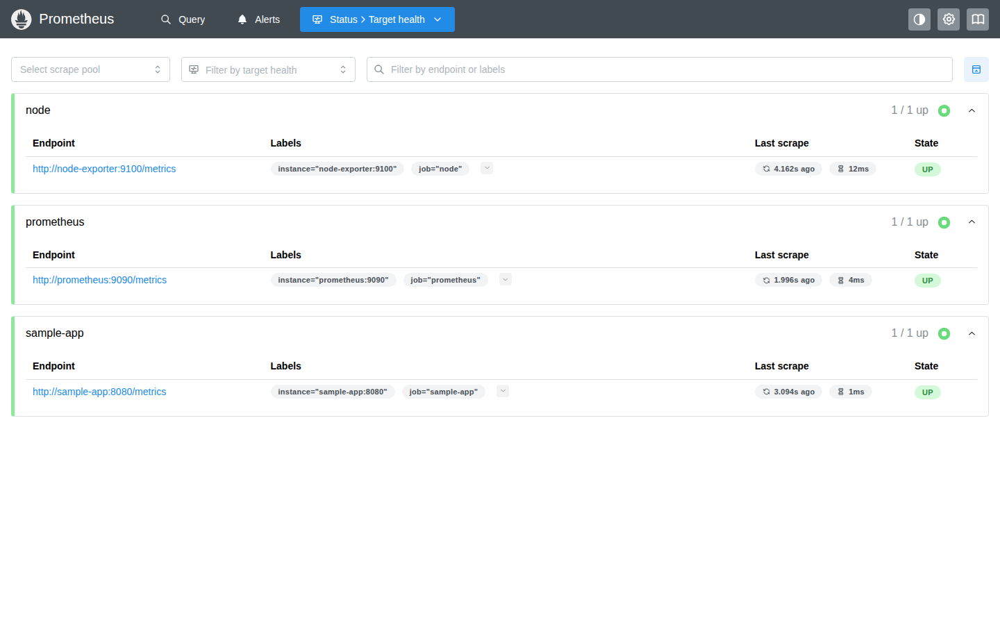
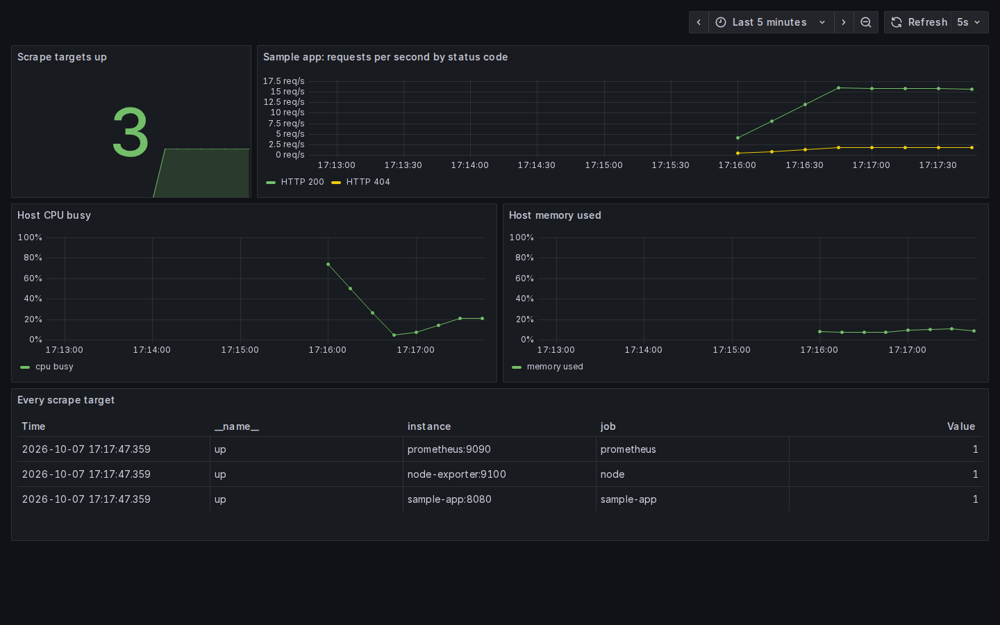
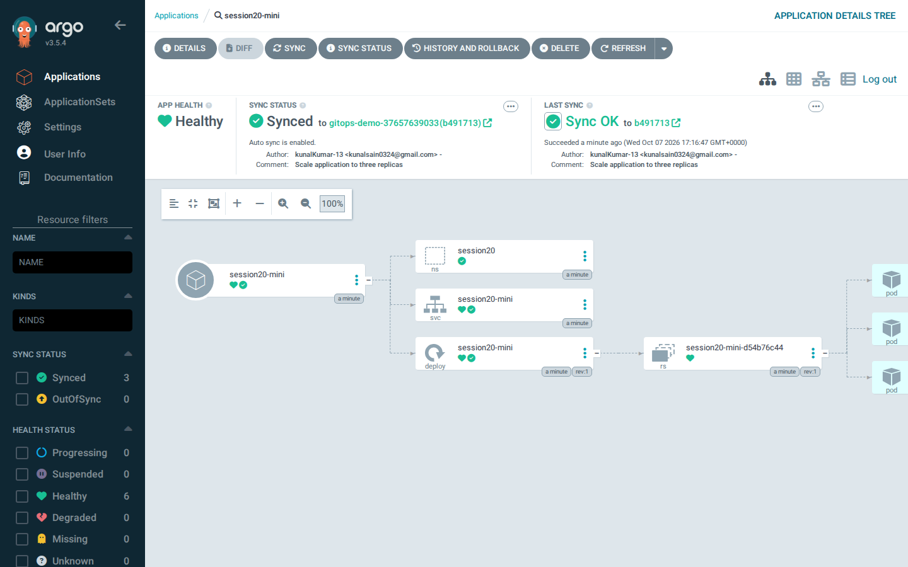
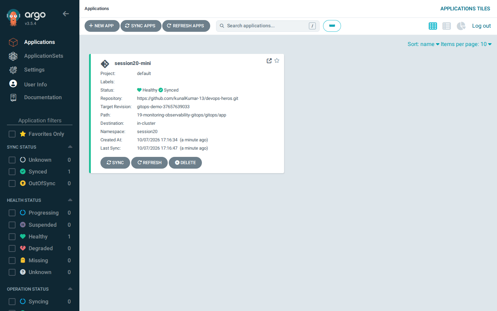

# Session 20 — Monitoring, Observability & GitOps

**Kunal Kumar · Roll No. 24BCS10027**

Two labs, both run for real in GitHub Actions:

1. **Monitoring.** Prometheus scrapes three targets (itself, a node exporter
   and a sample app); Grafana shows them on a dashboard. Both datasource and
   dashboard are provisioned from files in this folder, with nothing clicked
   by hand.
2. **GitOps (the mini-project).** Argo CD watches this repository and keeps a
   Kubernetes app in sync with it. The lab pushes a **real commit** that scales
   the app from 2 to 3 replicas and watches Argo CD deploy it, then changes the
   cluster by hand and watches Argo CD put it back.

- Lab scripts: [`monitoring-lab.sh`](monitoring-lab.sh), [`gitops-lab.sh`](gitops-lab.sh),
  run by the `monitoring` and `gitops` jobs in
  [`.github/workflows/sessions-lab.yml`](../.github/workflows/sessions-lab.yml)
- Transcripts: [`session-output-monitoring.txt`](session-output-monitoring.txt),
  [`session-output-gitops.txt`](session-output-gitops.txt)
- Screenshots: [`screenshots/`](screenshots/)

---

## Part 1: Prometheus and Grafana

```text
monitoring/
├── docker-compose.yml          prometheus v3.5.0, node-exporter v1.9.1, sample app, grafana 12.1.1
├── prometheus.yml              scrape every 5s: prometheus, node, sample-app
└── grafana/provisioning/
    ├── datasources/prometheus.yml   Prometheus as the default datasource
    └── dashboards/
        ├── provider.yml
        └── session20.json           targets up, requests/s by status code, host CPU, host memory
```

```bash
cd monitoring
export GRAFANA_ADMIN_PASSWORD=$(openssl rand -hex 16)   # compose refuses to start without one
docker compose up -d
# Prometheus  http://localhost:9090/targets
# Grafana     http://localhost:3000   (admin / $GRAFANA_ADMIN_PASSWORD)
```

The lab sends steady traffic to the sample app, about 1 request in 10 to
`/err`, then asks Prometheus questions in PromQL:

| Question | PromQL |
|---|---|
| Are all targets up? | `sum(up)` |
| Requests per second, by status code | `sum by (code) (rate(http_requests_total{job="sample-app"}[1m]))` |
| Error ratio | `sum(rate(http_requests_total{code!="200"}[1m])) / sum(rate(http_requests_total[1m]))` |
| Host CPU busy % | `100 - avg(rate(node_cpu_seconds_total{mode="idle"}[1m])) * 100` |

One thing I got wrong first: I sent a burst of 340 requests and then queried
right away, and the request rate came out as 0. `rate()` measures the
*increase between scrapes*, and the whole burst landed before the first
sample. Real traffic is a steady stream, so the lab now generates it in the
background for several minutes. The measured error ratio came out at 0.1,
which matches the 1-in-10 traffic.

| Prometheus targets | Grafana dashboard |
|---|---|
|  |  |

## Part 2: GitOps with Argo CD

```text
gitops/app/                 the desired state Argo CD watches
├── namespace.yaml          session20
├── deployment.yaml         session20-mini, nginx, replicas: 2
└── service.yaml
argocd/application.yaml     the Argo CD Application: this repo, that path,
                            automated sync with prune + selfHeal
```

```text
  Git (this repo)  ── desired state ──▶  Argo CD  ── sync ──▶  Kubernetes (kind)
        ▲                                   │
        └──────── compares continuously ────┘   actual state
```

What the lab does, step by step (the same steps as the mini-project):

1. Create a kind cluster and install Argo CD v3.5.4.
2. Create the Application pointing at `19-monitoring-observability-gitops/gitops/app`
   on a short-lived branch of this repository.
3. Argo CD syncs: namespace, Deployment with **2** ready pods, Service.
4. **Git change.** `sed` changes `replicas: 2` to `replicas: 3`, then
   `git commit -m "Scale application to three replicas"` and `git push`.
   No `kubectl` involved. Argo CD picks up the commit and the Deployment goes
   to **3/3**. The lab checks that the revision Argo CD synced is exactly the
   commit hash that was pushed.
5. **Self-healing.** `kubectl scale --replicas=1` by hand. Git still says 3,
   so Argo CD scales it straight back to 3.
6. **Drift on a deleted object.** `kubectl delete service` by hand; Argo CD
   recreates it.
7. Observe: pod logs and the Application's sync history.

The branch is created at the start of the job and deleted at the end, so the
demo commits never land on `assignment` itself.

| Application tree (Synced, Healthy) | Applications list |
|---|---|
|  |  |

---

## Viva questions

**1. Monitoring vs observability.** Monitoring watches for problems you already
know to look for: dashboards and alerts on CPU, error rate, latency. Observability is
being able to work out *why* something is wrong, including things you didn't
predict, from the signals the system gives out (metrics, logs, traces).
Monitoring tells you that the error rate went up; observability is what lets
you find which request and which service caused it.

**2. Metrics vs logs vs traces.** Metrics are numbers over time, cheap to keep
and good for trends and alerts (`http_requests_total`). Logs are individual
events with detail (one line per request, an error message). Traces follow one
request across services and show where the time went.

**3. Prometheus.** A time-series database that *pulls* metrics: every few
seconds it scrapes each target's `/metrics` endpoint over HTTP and stores the
samples. You query it with PromQL, and it can fire alerts.

**4. Grafana.** The visualisation layer. It doesn't store metrics itself, it
queries datasources like Prometheus and draws dashboards. Here the datasource
and dashboard are provisioned from files, so they're version-controlled too.

**5. GitOps.** Running operations through Git: the desired state of the
system lives in a Git repository, and an agent in the cluster keeps the
cluster matching it. Changes go through commits (and reviews), not through
people running `kubectl apply`.

**6. Why is Git the source of truth?** Because whatever Git says is what the
cluster will be made to look like. Anything changed by hand gets reverted. That
also gives you history (who changed what, when), review through pull requests,
and rollback with `git revert`.

**7. What does Argo CD do?** It runs in the cluster, watches a Git repo path,
compares the manifests there with what's actually running, shows the
difference (OutOfSync), and syncs. With automated sync it does that on its
own; with `selfHeal` it also undoes manual changes, and with `prune` it deletes
things removed from Git.

**8. Desired state.** What you've declared should exist: here, the manifests in
`gitops/app/` (a Deployment with 3 replicas, after the change).

**9. Actual state.** What is really running in the cluster right now. After my
`kubectl scale --replicas=1` the actual state was 1 replica.

**10. Reconciliation.** The loop that compares desired with actual and acts to
close the gap. Kubernetes controllers do it for pods; Argo CD does it one level
up, between Git and the cluster.

**11. Self-healing in Argo CD.** With `selfHeal: true`, if someone changes a
managed object directly in the cluster, Argo CD detects the drift and puts
it back to what Git says. In the lab: scaled to 1 by hand, back to 3 within
seconds.

**12. What happens when replicas change from 2 to 3 in Git?** Argo CD notices
the new commit (polling, or a webhook), marks the app OutOfSync, applies the
new Deployment, and Kubernetes starts a third pod. The Application then shows
Synced at the new commit hash. Nobody ran `kubectl`.

---

## What happened when it ran

Every command below ran in GitHub Actions on a fresh machine; these are verbatim excerpts of the transcript.

Run: <https://github.com/kunalKumar-13/devops-heros/actions/runs/37657639033>

**Verified results: 6 passed, 0 failed** (the checks the lab script makes; the job fails if any of them fail):

```text
  PASS  all 3 scrape targets are up
  PASS  Prometheus measures live traffic (rate = 17.818181818181817 req/s)
  PASS  the error ratio is measured and plausible (about 10%: 0.1)
  PASS  Grafana is healthy
  PASS  the Prometheus datasource was provisioned
  PASS  the Session 20 dashboard was provisioned
```

**4. Prometheus: are all scrape targets up?**

```console
kunal@monitoring-lab:~$ curl -s localhost:9090/api/v1/targets | python3 -c "import json,sys; [print(t['labels']['job'].ljust(12), t['scrapeUrl'].ljust(36), t['health']) for t in json.load(sys.stdin)['data']['activeTargets']]"
node         http://node-exporter:9100/metrics    up
prometheus   http://prometheus:9090/metrics       up
sample-app   http://sample-app:8080/metrics       up
```

**5. PromQL queries**

```console
kunal@monitoring-lab:~$ # sum(up)
{} => 3

kunal@monitoring-lab:~$ # requests per second by status code
{'code': '200'} => 16.036363636363635
{'code': '404'} => 1.7818181818181817

kunal@monitoring-lab:~$ # error ratio
{} => 0.1

kunal@monitoring-lab:~$ # host CPU busy %
{} => 4.534627902325482
```

**Verified results: 6 passed, 0 failed** (the checks the lab script makes; the job fails if any of them fail):

```text
  PASS  Argo CD reports the app Synced and Healthy
  PASS  Argo CD created the deployment with 2 ready replicas, as Git says
  PASS  after the Git change the deployment has 3 ready replicas
  PASS  Argo CD synced exactly the commit that was pushed
  PASS  self-healing: a manual scale to 1 was reverted to 3
  PASS  a Service deleted by hand was recreated by Argo CD
```

**4. What Argo CD created in the cluster**

```console
kunal@gitops-lab:~$ kubectl get all -n session20
NAME                                 READY   STATUS    RESTARTS   AGE
pod/session20-mini-d54b76c44-76nn6   1/1     Running   0          4s
pod/session20-mini-d54b76c44-m4zwt   1/1     Running   0          4s

NAME                     TYPE        CLUSTER-IP    EXTERNAL-IP   PORT(S)   AGE
service/session20-mini   ClusterIP   10.96.35.88   <none>        80/TCP    4s

NAME                             READY   UP-TO-DATE   AVAILABLE   AGE
deployment.apps/session20-mini   2/2     2            2           4s

NAME                                       DESIRED   CURRENT   READY   AGE
replicaset.apps/session20-mini-d54b76c44   2         2         2       4s
```

**5. Make a Git change: scale from 2 to 3 replicas, in Git only**

```console
kunal@gitops-lab:~$ sed -i 's/replicas: 2/replicas: 3/' gitops/app/deployment.yaml && git diff gitops/app/deployment.yaml
diff --git a/19-monitoring-observability-gitops/gitops/app/deployment.yaml b/19-monitoring-observability-gitops/gitops/app/deployment.yaml
index c37e8a5..b8f1bd7 100644
--- a/19-monitoring-observability-gitops/gitops/app/deployment.yaml
+++ b/19-monitoring-observability-gitops/gitops/app/deployment.yaml
@@ -8,7 +8,7 @@ metadata:
   labels:
     app: session20-mini
 spec:
-  replicas: 2
+  replicas: 3
   selector:
     matchLabels:
       app: session20-mini

kunal@gitops-lab:~$ git add gitops/app/deployment.yaml && git -c user.name=kunalKumar-13 -c user.email=kunalsain0324@gmail.com commit -q -m 'Scale application to three replicas' && git log --oneline -1
b491713 Scale application to three replicas

kunal@gitops-lab:~$ git push -q origin HEAD:gitops-demo-37657639033 && echo pushed to gitops-demo-37657639033
pushed to gitops-demo-37657639033

>>> no kubectl apply from here on: only Git changed

kunal@gitops-lab:~$ kubectl annotate application session20-mini -n argocd argocd.argoproj.io/refresh=normal --overwrite
application.argoproj.io/session20-mini annotated

kunal@gitops-lab:~$ kubectl get deployment session20-mini -n session20
NAME             READY   UP-TO-DATE   AVAILABLE   AGE
session20-mini   3/3     3            3           8s

kunal@gitops-lab:~$ kubectl get application session20-mini -n argocd -o jsonpath='synced to commit: {.status.sync.revision}{"\n"}'
synced to commit: b491713041342de3d65a5dfc37c2a81ba512d382

kunal@gitops-lab:~$ git rev-parse HEAD
b491713041342de3d65a5dfc37c2a81ba512d382

>>> the synced revision is the commit just pushed: Git -> Argo CD -> Kubernetes
```

**6. Self-healing: change the cluster by hand and watch Argo CD undo it**

```console
kunal@gitops-lab:~$ kubectl scale deployment session20-mini -n session20 --replicas=1
deployment.apps/session20-mini scaled

kunal@gitops-lab:~$ kubectl get deployment session20-mini -n session20
NAME             READY   UP-TO-DATE   AVAILABLE   AGE
session20-mini   1/1     1            1           9s

>>> Git still says 3, and selfHeal is on

kunal@gitops-lab:~$ kubectl get deployment session20-mini -n session20
NAME             READY   UP-TO-DATE   AVAILABLE   AGE
session20-mini   3/3     3            3           12s

kunal@gitops-lab:~$ kubectl get events -n session20 --sort-by=.lastTimestamp | grep -i scaled | tail -4
12s         Normal    ScalingReplicaSet   deployment/session20-mini             Scaled up replica set session20-mini-d54b76c44 from 0 to 2
6s          Normal    ScalingReplicaSet   deployment/session20-mini             Scaled up replica set session20-mini-d54b76c44 from 2 to 3
4s          Normal    ScalingReplicaSet   deployment/session20-mini             Scaled down replica set session20-mini-d54b76c44 from 3 to 1
3s          Normal    ScalingReplicaSet   deployment/session20-mini             Scaled up replica set session20-mini-d54b76c44 from 1 to 3
```

**7. Pruning: delete the Service by hand, Argo CD recreates it**

```console
kunal@gitops-lab:~$ kubectl delete service session20-mini -n session20
service "session20-mini" deleted from session20 namespace

kunal@gitops-lab:~$ kubectl get service session20-mini -n session20
NAME             TYPE        CLUSTER-IP     EXTERNAL-IP   PORT(S)   AGE
session20-mini   ClusterIP   10.96.149.76   <none>        80/TCP    20s
```

